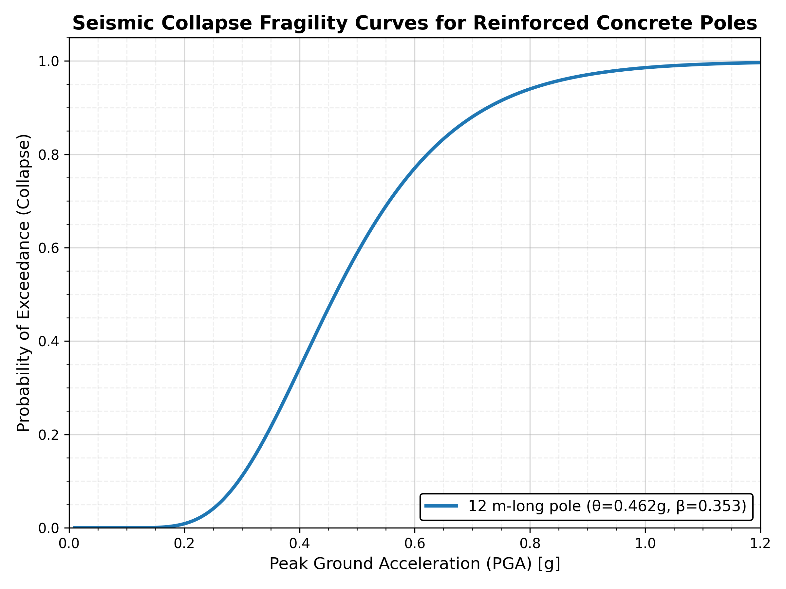

# Enhancing Distribution Grid Resilience Against High-Impact, Low-Probability Events Through Optimal Distributed Generation Placement and Risk-Aware Microgrid Planning

Laila Nur Rizqi Tasnimiyah, Wijaya Yudha Atmaja, Mokhammad Isnaeni Bambang Setyonegoro
Department of Electrical and Information Engineering, Universitas Gadjah Mada

## Overview

This paper proposes a two-stage risk-averse stochastic Mixed-Integer Linear Programming (MILP) framework for pre-disaster Distributed Generation (DG) placement, approximated via Sample Average Approximation (SAA). Risk-aversion is formalized using Conditional Value-at-Risk (CVaR) at the 90th percentile. Fault scenarios are generated from seismic pole fragility curves, and a linearized three-phase unbalanced power flow (LinDistFlow) with fictitious-flow radiality constraints ensures steady-state islanding feasibility. The framework is validated on a synthetic overhead feeder adapted from the IEEE 37-bus topology, with results cross-checked against OpenDSS for AC power-flow consistency.

## Repository Contents

| File | Description |
|---|---|
| `main.tex` | Full paper source (IEEEtran conference format) |
| `references.bib` | Bibliography |
| `IEEEtran.cls` | IEEE conference LaTeX class |
| `IEEEtran_HOWTO.pdf` | IEEEtran usage reference |
| `basecase.png` | Test feeder topology |
| `seismic_fragility_curve.png` | Pole fragility curve (PGA vs. failure probability) |
| `investment_pga_lambda_swarm.png` | DG investment cost across SAA replications, by PGA and λ |
| `pga030exampl.png` | Example post-event microgrid formation (PGA = 0.3g, λ = 0) |

## Figures

**Test feeder (modified IEEE 37-bus):**


**Seismic fragility curve:**



**Example case — post-event microgrid formation, PGA = 0.3g, risk-neutral (λ = 0):**


**DG investment across SAA replications:**


## Building

Compile with `latexmk`:

```
latexmk -pdf main.tex
```

or manually:

```
pdflatex main.tex
bibtex main
pdflatex main.tex
pdflatex main.tex
```

## Key Results

- Design-basis case (PGA = 0.3g): risk-neutral investment \$793.4k vs. risk-averse (λ = 0.75) \$961.8k.
- Value of risk-aversion is inversely related to hazard intensity — largest resilience gain at low PGA (0.23g), diminishing at severe PGA (0.40g) where network fragmentation, not generation capacity, becomes the binding constraint.
- Validated against OpenDSS across 90,000 scenario-configuration pairs; only 62 violations recorded, all minor DG active-power overshoots (≤ +1.02%) attributable to the MILP's linearized, loss-free formulation.

## Code

Simulation code (scenario generation, MILP, OpenDSS validation) available at: `[add GitHub link here]`
