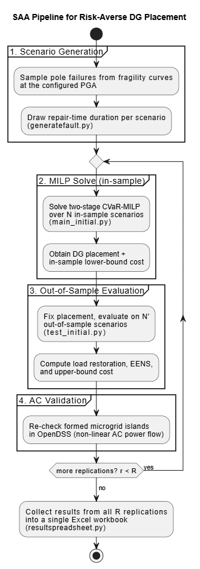
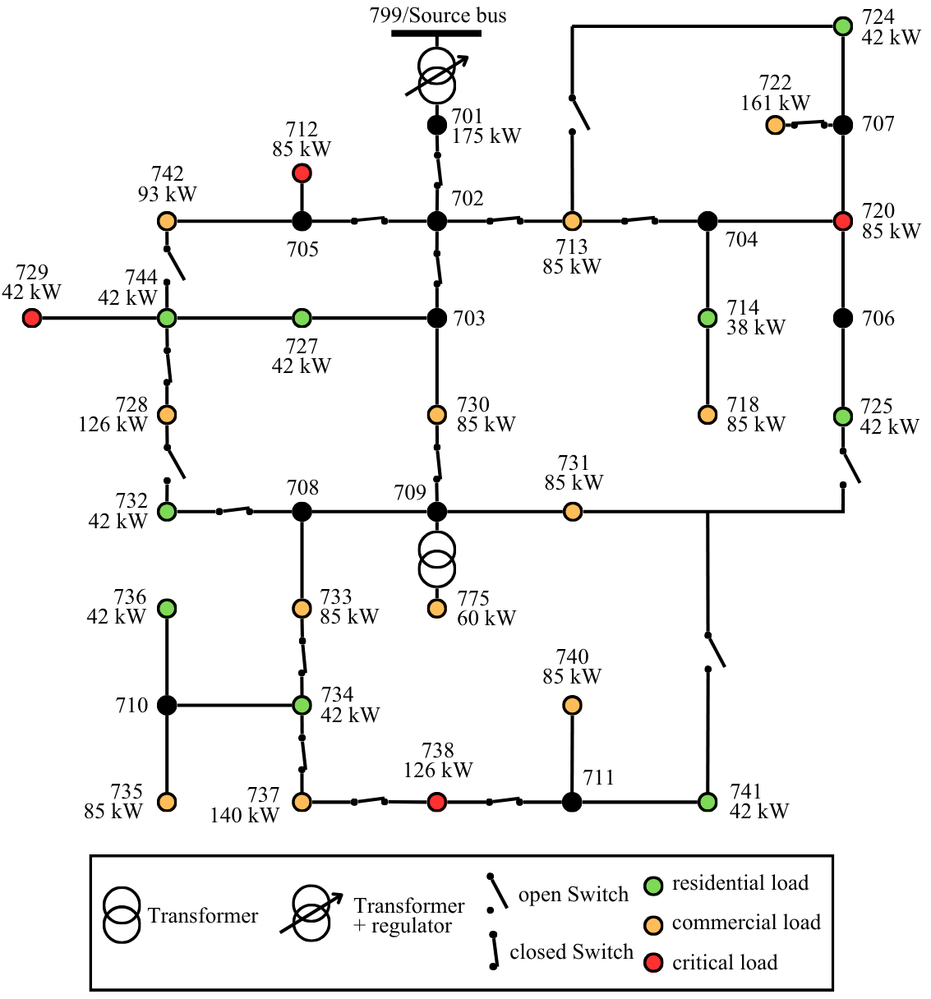
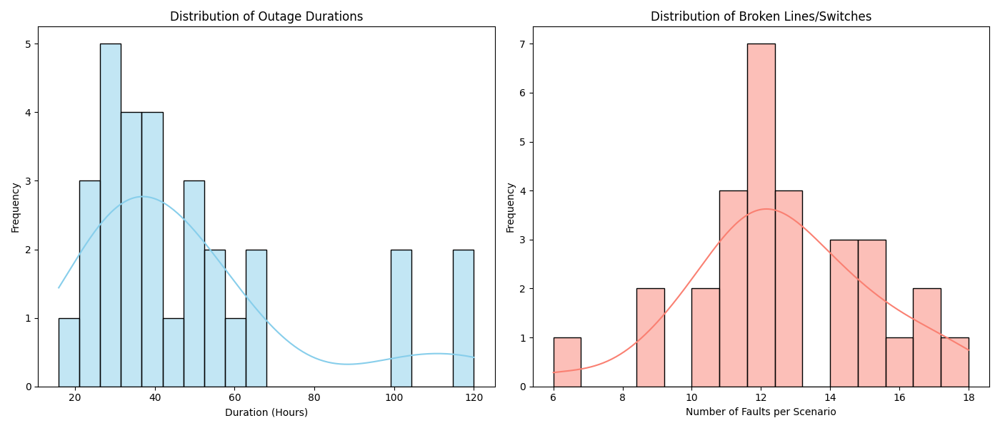
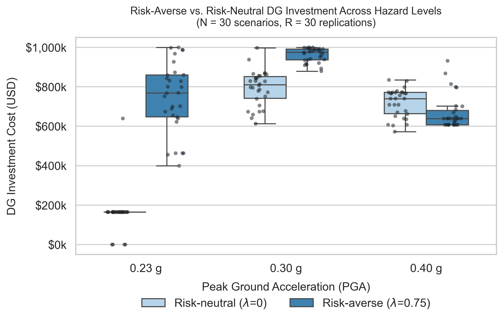
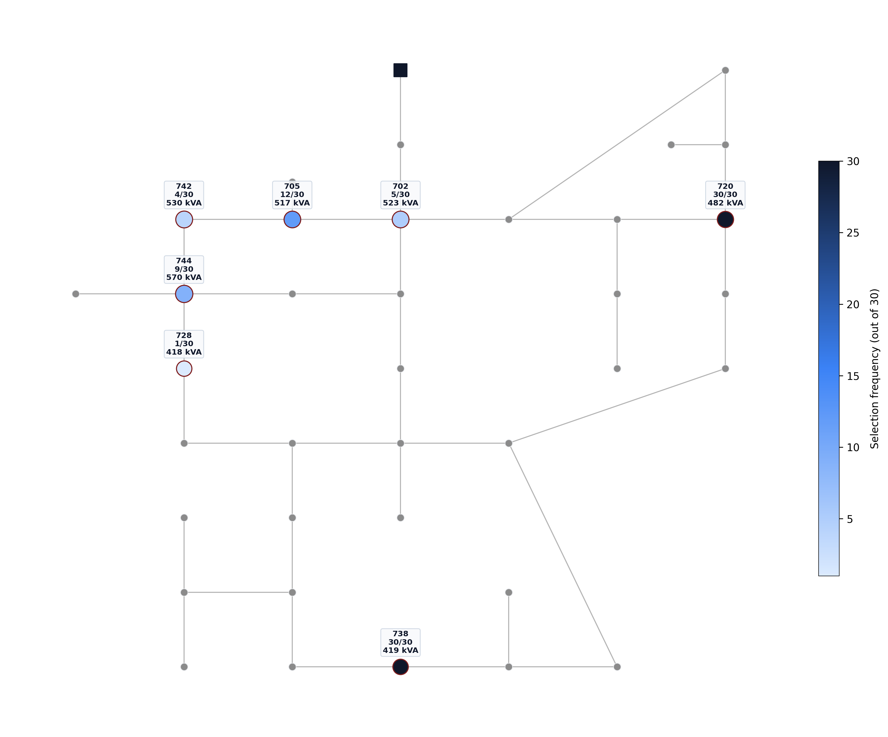
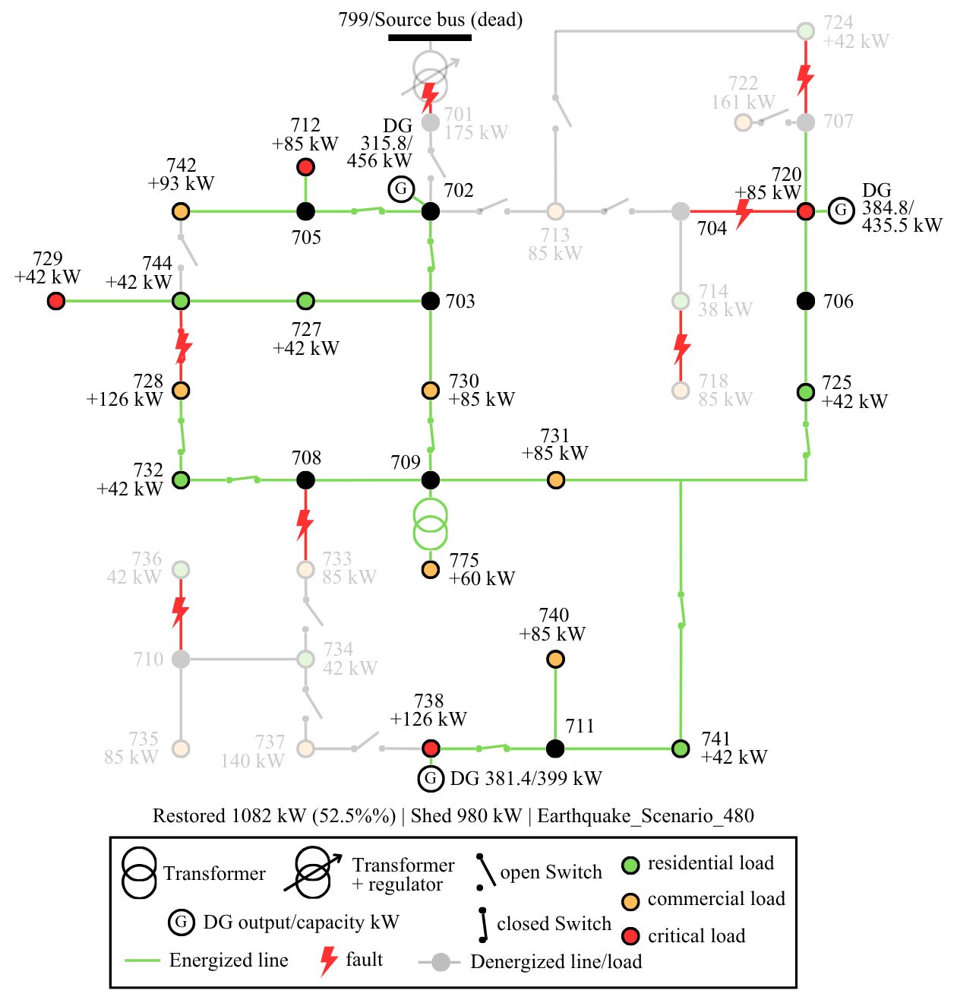

# Risk-Averse DG Placement for Seismic Distribution Resilience


This repository contains the code used to study pre-disaster DG placement for seismic resilience in distribution networks. The optimization problem is formulated as a two-stage stochastic MILP and solved using Sample Average Approximation (SAA). Risk aversion is incorporated through a CVaR-based objective, and the resulting MILP is solved with Gurobi.

Seismic fault scenarios are generated by sampling pole failures from seismic fragility curves. The MILP uses a linearized three-phase unbalanced power-flow model together with radiality constraints to determine feasible island configurations. The resulting solutions are then checked using non-linear AC power flow in OpenDSS, on a synthetic feeder adapted from the IEEE 37-bus topology.

---

## How It Works



The pipeline runs in four stages:

1. **Scenario Generation**: Samples earthquake-induced line failures from a lognormal pole-fragility model at a given PGA, and draw a corresponding lognormal repair-time duration per scenario.
2. **MILP Solve (in-sample)**: Solves the risk-averse two-stage stochastic MILP (CVaR-weighted objective) using `N` in-sample scenarios, obtaining a candidate DG placement and its in-sample cost estimate.
3. **Out-of-Sample Evaluation**: Fixes the placement and evaluates it on an independent out-of-sample set containing many more scenario using load restoration, EENS, and other scenario-level results.
4. **AC Validation & Results**: Re-checks each formed microgrid island in OpenDSS using non-linear AC power flow in the steady state. The results from all replications are then collected into a single Excel workbook.

---

## Tech Stack

The project is written in Python 3 and uses the following packages:

- **PuLP** (3.3.0) to define the MILP model.
- **Gurobi / gurobipy** (13.0.1) to solve the optimization problems. A valid local Gurobi license is required; cloning the repository alone is not sufficient to run the optimization.
- **OpenDSSDirect.py** (0.9.4) to check the MILP solutions using non-linear AC power flow. The version is kept fixed because changes in the OpenDSS API can affect compatibility with the code.
- **NetworkX** (3.6.1) to represent and work with the feeder topology.
- **NumPy** and **Pandas** for numerical calculations, scenario generation, and processing the results.
- **openpyxl** to generate the final Excel reports.

The code was developed and tested with Python 3.14. The package versions listed above are the versions used for the reported results.

---

## How to Run

First, clone the repository:

```bash
git clone https://github.com/LailaNRT/optimal-dg-placement-sizing-resilience.git
```

Before running the study, configure the desired PGA and parameter sweep at the top of `saa_convergence_study.py`. The sweep can include parameters such as `N`, `lambda`, `rho`, `sigma`, `alpha`, and the investment budget.

You can then run the full study with:

```bash
python saa_convergence_study.py
```

This script runs the full SAA study. For each configured parameter combination, it:

1. Generates the fault scenarios using `generatefault.py`.
2. Runs the in-sample optimization and out-of-sample evaluation for all `R` replications.
3. Collects the results into an Excel workbook using `resultspreadsheet.py`.

The output is saved as `SAA_Compiled_Results_Advanced_<run_label>.xlsx`.

`PGA` is fixed for each run and is not part of the parameter sweep. To reproduce results for multiple hazard levels, such as 0.23g, 0.30g, and 0.40g, change the `PGA` value and run the script separately for each level.

The `<run_label>` is generated automatically from the configuration. For example, `pga030N30L000Y15R010_rho00_sig50` identifies the PGA and the main SAA parameter settings used for that run.

---

## Repository Structure

| File | Role |
|---|---|
| `generatefault.py` | Seismic pole-fragility model and Monte Carlo fault-scenario generation |
| `main_initial.py` | Two-stage risk-averse stochastic MILP formulation and CVaR objective |
| `saa_convergence_study.py` | SAA replication driver: orchestrates R independent in-sample solves and out-of-sample evaluations |
| `test_initial.py` | Out-of-sample OpenDSS AC power-flow evaluation across the N'=500 scenario set per replication |
| `testing_initial.py` | Single-scenario diagnostic viewer for inspecting one fault scenario's DG dispatch and per-phase bus voltages |
| `checkPQbranch.py` | Post-hoc violation scanner applying the dispatch/voltage criteria across all replications and hazard labels |
| `resultspreadsheet.py` | Compiles the per-iteration JSON outputs into an aggregated Excel summary (SAA statistics, DG dispatch, load restoration) |
| `ieee37.dss` | IEEE 37-bus test feeder model |
| `IEEE37_BusXY.csv` | Bus coordinate data used for topology visualisation |

---

## Regenerating Figures

These scripts are separate from the main SAA pipeline. They read the JSON and Excel files generated by the pipeline and produce the figures used for analysis. You can run them once `saa_convergence_study.py` has finished.

| Script | Reads | Produces |
|---|---|---|
| `dg_heatmap.py` | `master_dg_placements_<run_label>_*.json` (all iterations), `ieee37.dss`, `IEEE37_BusXY.csv` | DG placement heatmap and selection frequency/capacity charts |
| `cvar_swarm_plot.py` | `SAA_Compiled_Results_Advanced_*.xlsx` (all six PGA-λ combinations) | Investment distribution box-and-strip plot across hazard levels and risk-aversion settings |
| `plotlinehourdistribiution.py` | A single `saa_scenario_*.json` file | Histograms of outage duration and broken-line count |

---

## Data Format

**Scenario file** (`saa_scenario_*.json` / `500_scenarios_*.json`):
```json
{
  "metadata": { "pga_g": 0.30, "rho": 0.0, "sigma": 0.5, "num_scenarios": 30 },
  "Normal_Operation": { "faults": [], "duration_hours": 0.0 },
  "Earthquake_Scenario_01": { "faults": ["line1", "line2"], "duration_hours": 42.3 }
}
```

**DG placement file** (`master_dg_placements_*.json`):
```json
{
  "financials": { "total_investment_cost_CINV": 793400.0, "om_present_value": 56776.2 },
  "dg_placement": { "purchased_buses": ["738", "720"], "sizes_kva": { "738": 418.8, "720": 482.3 } }
}
```
DG sizes are stored as nameplate apparent power in kVA; active/reactive power limits are derived as 0.8×kVA and 0.6×kVA respectively (0.8 power factor).

---

## Example Output

**Modified IEEE 37-bus test feeder** (`ieee37.dss`, coordinates from `IEEE37_BusXY.csv`):



**Fault scenario generation** (produced via `plotlinehourdistribiution.py`): broken lines / outage duration across one replication



**SAA solution quality** (produced via `cvar_swarm_plot.py` and `dg_heatmap.py`):

| DG Investment vs. Risk Aversion | DG Placement Frequency |
|---|---|
|  |  |

**Post-event microgrid formation** (single representative fault scenario, PGA = 0.3g):



---

## Acknowledgments

This work was carried out as part of an undergraduate thesis at the Department of Electrical and Information Engineering, Universitas Gadjah Mada. Supervised by Dr. Wijaya Yudha Atmaja, S.T., M.Eng. and Dr. Ir. Mokhammad Isnaeni Bambang Setyonegoro, M.T.

---

**Undergraduate Thesis (Skripsi), Department of Electrical and Information Engineering**
**Universitas Gadjah Mada (2026)**
